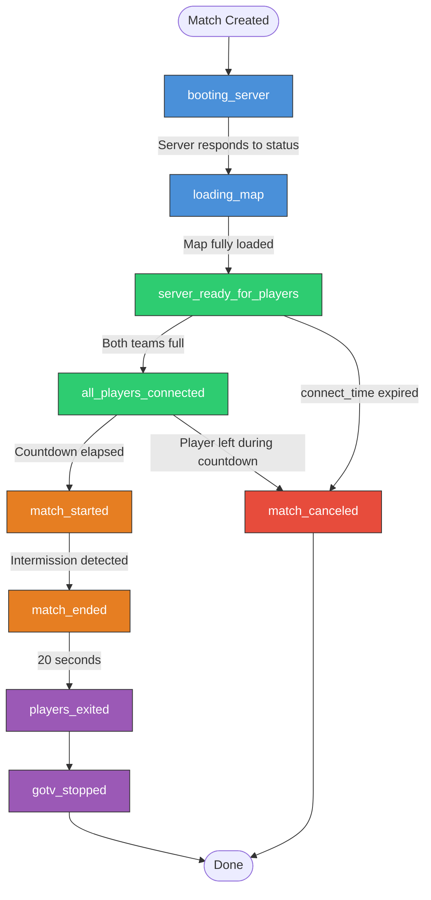

Fetch the complete documentation index at: https://dathost.readme.io/llms.txt. Use this file to discover all available pages before exploring further. Append .md to any documentation page URL to get its markdown version.

# Webhooks

We now support two ways to receive match-related event notifications: through a single event-driven webhook (`event_url`), or using specific event webhooks (e.g., `match_end_url`, `round_end_url`). We recommend using the new event-driven webhooks for greater control and flexibility.

## Event-Driven Webhooks (Recommended)

You can now configure a single `event_url` to receive webhooks for a variety of match-related events. By setting the `enabled_events` parameter, you control which events trigger webhooks.

Each event will include a UNIX timestamp to provide precise timing.

**Example configuration:**

```json
  "webhooks": {
    "match_end_url": "",
    "round_end_url": "",
    "player_votekick_success_url": "",
    "event_url": "https://webhook.site/123",
    "enabled_events": [
      "match_started",
      "match_ended",
      "round_end"
    ],
    "authorization_header": ""
  },
```

The available event types for `enabled_events` are:

* `booting_server`
* `loading_map`
* `server_ready_for_players`
* `all_players_connected`
* `match_started`
* `match_ended`
* `players_exited`
* `gotv_stopped`
* `player_connected`
* `player_disconnected`
* `player_votekicked`
* `round_end`
* `match_canceled`

If you want to subscribe to all events, simply use `["*"]` for `enabled_events`

<br />



### Event types

<Table align={["left","left","left"]}>
  <thead>
    <tr>
      <th>
        Match lifecycle events (fired in order)
      </th>

      <th>
        When it fires
      </th>

      <th>
        Payload
      </th>
    </tr>
  </thead>

  <tbody>
    <tr>
      <td>
        `booting_server`
      </td>

      <td>
        When the match is created and the game server is starting up. This is the initial state of every match.
      </td>

      <td>
        —
      </td>
    </tr>

    <tr>
      <td>
        `loading_map`
      </td>

      <td>
        When the server has finished booting and the map change command has been issued.
      </td>

      <td>
        —
      </td>
    </tr>

    <tr>
      <td>
        `server_ready_for_players`
      </td>

      <td>
        When the map has fully loaded and all server configuration (cvars, passwords, warmup) has been applied. Players can now connect.
      </td>

      <td>
        —
      </td>
    </tr>

    <tr>
      <td>
        `all_players_connected`
      </td>

      <td>
        When both teams have the required number of players connected. The pre-match countdown begins (`match_begin_countdown`, default 30s).
      </td>

      <td>
        —
      </td>
    </tr>

    <tr>
      <td>
        `match_started`
      </td>

      <td>
        When the countdown has elapsed and both teams are still full. Warmup ends and competitive play begins.
      </td>

      <td>
        —
      </td>
    </tr>

    <tr>
      <td>
        `match_ended`
      </td>

      <td>
        When the game reaches intermission (a team wins the required number of rounds). A 20-second grace period begins.
      </td>

      <td>
        —
      </td>
    </tr>

    <tr>
      <td>
        `players_exited`
      </td>

      <td>
        20 seconds after `match_ended`. All players and bots are kicked from the server.
      </td>

      <td>
        —
      </td>
    </tr>

    <tr>
      <td>
        `gotv_stopped`
      </td>

      <td>
        When the GOTV demo recording is stopped and the match is fully deactivated. This is the final event.

        * If `wait_for_gotv` is `false` (default): fires immediately after `players_exited`.
        * If `true`: fires after an additional `tv_delay` seconds (default 105s) so the GOTV broadcast finishes without spoiling the result.
      </td>

      <td>
        —
      </td>
    </tr>

    <tr>
      <td>
        **Player Events (can fire at any time**)
      </td>

      <td>

      </td>

      <td>

      </td>
    </tr>

    <tr>
      <td>
        `player_connected`
      </td>

      <td>
        When a registered match player connects to the server and joins a team.
      </td>

      <td>
        `steam_id_64`
      </td>
    </tr>

    <tr>
      <td>
        `player_disconnected`
      </td>

      <td>
        When a previously connected player disconnects. Includes voluntary disconnects, network drops, and being kicked for joining the wrong team.
      </td>

      <td>
        `steam_id_64`
      </td>
    </tr>

    <tr>
      <td>
        `player_votekicked`
      </td>

      <td>
        When a player is kicked via an in-game vote. Fires in addition to `player_disconnected`.
      </td>

      <td>
        `steam_id_64`
      </td>
    </tr>

    <tr>
      <td>
        **Round Events**
      </td>

      <td>

      </td>

      <td>

      </td>
    </tr>

    <tr>
      <td>
        `round_end`
      </td>

      <td>
        At the end of each round, once the round stats have been parsed.
      </td>

      <td>
        `team1_score`, `team2_score`
      </td>
    </tr>

    <tr>
      <td>
        **Cancellation**
      </td>

      <td>

      </td>

      <td>

      </td>
    </tr>

    <tr>
      <td>
        `match_canceled`
      </td>

      <td>
        When the match is canceled because not all required players connected within the `connect_time` window (default 300s). The match's `cancel_reason` field will contain `MISSING_PLAYERS:<steam_ids>`.
      </td>

      <td>
        —
      </td>
    </tr>
  </tbody>
</Table>

### Example webhook response when match ended

```json
{
  "id": "6502a8923d1c32e7d4d7f760",
  "game_server_id": "6503b7832e1d23f8c5c6f762",
  "team1": {
    "name": "Ninjas in Pyjamas",
    "flag": "SE",
    "stats": {
      "score": 2
    }
  },
  "team2": {
    "name": "Astralis",
    "flag": "DK",
    "stats": {
      "score": 4
    }
  },
  "players": [
    {
      "match_id": "6502a8923d1c32e7d4d7f760",
      "steam_id_64": "76561198234907126",
      "team": "team1",
      "nickname_override": "Player One",
      "connected": true,
      "kicked": false,
      "disconnected_at": null,
      "stats": {
        "kills": 0,
        "assists": 0,
        "deaths": 0,
        "mvps": 1,
        "score": 4,
        "2ks": 0,
        "3ks": 0,
        "4ks": 0,
        "5ks": 0,
        "kills_with_headshot": 0,
        "kills_with_pistol": 0,
        "kills_with_sniper": 0,
        "damage_dealt": 0,
        "entry_attempts": 0,
        "entry_successes": 0,
        "flashes_thrown": 0,
        "flashes_successful": 0,
        "flashes_enemies_blinded": 0,
        "utility_thrown": 0,
        "utility_damage": 0,
        "1vX_attempts": 0,
        "1vX_wins": 0
      }
    }
  ],
  "settings": {
    "map": "de_mirage",
    "password": null,
    "connect_time": 90,
    "match_begin_countdown": 20,
    "team_size": null,
    "wait_for_gotv": false,
    "enable_plugin": true,
    "enable_tech_pause": false
  },
  "webhooks": {
    "match_end_url": "",
    "round_end_url": "",
    "player_votekick_success_url": "",
    "event_url": "https://webhook.site/123",
    "enabled_events": [
      "match_started",
      "match_ended",
      "round_end"
    ],
    "authorization_header": ""
  },
  "rounds_played": 6,
  "finished": true,
  "cancel_reason": null,
  "events": [
    {
      "event": "booting_server",
      "timestamp": 1728985171
    },
    {
      "event": "loading_map",
      "timestamp": 1728985178
    },
    {
      "event": "server_ready_for_players",
      "timestamp": 1728985179
    },
    {
      "event": "player_connected",
      "timestamp": 1728985183,
      "payload": {
        "steam_id_64": "76561198234907126"
      }
    },
    {
      "event": "all_players_connected",
      "timestamp": 1728985183
    },
    {
      "event": "match_started",
      "timestamp": 1728985201
    },
    {
      "event": "round_end",
      "timestamp": 1728985275,
      "payload": {
        "team1_score": 0,
        "team2_score": 1
      }
    },
    {
      "event": "round_end",
      "timestamp": 1728985279,
      "payload": {
        "team1_score": 1,
        "team2_score": 1
      }
    },
    {
      "event": "round_end",
      "timestamp": 1728985282,
      "payload": {
        "team1_score": 2,
        "team2_score": 1
      }
    },
    {
      "event": "round_end",
      "timestamp": 1728985289,
      "payload": {
        "team1_score": 2,
        "team2_score": 2
      }
    },
    {
      "event": "round_end",
      "timestamp": 1728985293,
      "payload": {
        "team1_score": 2,
        "team2_score": 3
      }
    },
    {
      "event": "round_end",
      "timestamp": 1728985297,
      "payload": {
        "team1_score": 2,
        "team2_score": 4
      }
    },
    {
      "event": "match_ended",
      "timestamp": 1728985297
    }
  ]
}
```

<br />

## Legacy Webhook Integration

For simplicity, we still support specific webhook URLs for key events like match end, round end, and player votekick success. These are straightforward but provide less customization compared to the event-driven approach.

### Match End

`webhooks.match_end_url`

Here is an example webhook of a match ending 13-7, sent immediately after the match ends.

```json
{
    "id": "6502a8923d1c32e7d4d7f760",
    "game_server_id": "6503b7832e1d23f8c5c6f762",
    "team1": {
      "name": "Ninjas in Pyjamas",
      "flag": "SE",
      "stats": {
        "score": 13
      }
    },
    "team2": {
      "name": "Astralis",
      "flag": "DK",
      "stats": {
        "score": 7
      }
    },
    "players": [
      {
        "match_id": "6502a8923d1c32e7d4d7f760",
        "steam_id_64": "76561198234907126",
        "team": "team1",
        "nickname_override": "Player One",
        "connected": true,
        "kicked": false,
        "stats": {
          "kills": 24,
          "assists": 2,
          "deaths": 12,
          "mvps": 6,
          "score": 54,
          "2ks": 3,
          "3ks": 1,
          "4ks": 0,
          "5ks": 1,
          "kills_with_headshot": 14,
          "kills_with_pistol": 3,
          "kills_with_sniper": 5,
          "damage_dealt": 2454,
          "flashes_thrown": 29,
          "flashes_successful": 12,
          "flashes_enemies_blinded": 17,
          "utility_thrown": 15,
          "utility_damage": 327,
          "entry_attempts": 12,
          "entry_successes": 7,
          "1vX_attempts": 5,
          "1vX_wins": 2
        }
      },
      ...
    ],
    "settings": {
      "map": "de_mirage",
      "password": null,
      "connect_time": 300,
      "match_begin_countdown": 30,
      "team_size": null,
      "wait_for_gotv": false,
      "enable_plugin": true,
      "enable_tech_pause": true
    },
    "webhooks": {
      "match_end_url": "https://webhook.site/123",
      "round_end_url": "https://webhook.site/124",
      "player_votekick_success_url": "https://webhook.site/125",
      "authorization_header": ""
    },
    "rounds_played": 20,
    "finished": true,
    "cancel_reason": null
  }
```

### Round End

`webhooks.round_end_url`

Here is an example webhook of how it can look after 5 rounds played:

```json
  {
    "id": "6502a8923d1c32e7d4d7f760",
    "game_server_id": "6503b7832e1d23f8c5c6f762",
    "team1": {
      "name": "Ninjas in Pyjamas",
      "flag": "SE",
      "stats": {
        "score": 3
      }
    },
    "team2": {
      "name": "Astralis",
      "flag": "DK",
      "stats": {
        "score": 2
      }
    },
    "players": [
      {
        "match_id": "6502a8923d1c32e7d4d7f760",
        "steam_id_64": "76561198234907126",
        "team": "team1",
        "nickname_override": "Player One",
        "connected": true,
        "kicked": false,
        "stats": {
          "kills": 7,
          "assists": 2,
          "deaths": 3,
          "mvps": 2,
          "score": 17,
          "2ks": 1,
          "3ks": 0,
          "4ks": 0,
          "5ks": 0,
          "kills_with_headshot": 4,
          "kills_with_pistol": 1,
          "kills_with_sniper": 1,
          "damage_dealt": 854,
          "flashes_thrown": 12,
          "flashes_successful": 2,
          "flashes_enemies_blinded": 3,
          "utility_thrown": 2,
          "utility_damage": 134,
          "entry_attempts": 2,
          "entry_successes": 2,
          "1vX_attempts": 1,
          "1vX_wins": 0
        }
      },
      ...
    ],
    "settings": {
      "map": "de_mirage",
      "password": null,
      "connect_time": 300,
      "match_begin_countdown": 30,
      "team_size": null,
      "wait_for_gotv": false,
      "enable_plugin": true,
      "enable_tech_pause": true
    },
    "webhooks": {
      "match_end_url": "https://webhook.site/123",
      "round_end_url": "https://webhook.site/124",
      "player_votekick_success_url": "https://webhook.site/125",
      "authorization_header": ""
    },
    "rounds_played": 5,
    "finished": false,
    "cancel_reason": null
  }
```

### Player Votekick Success

`webhooks.player_votekick_success_url`

Here is an example webhook sent immediately after a player is kicked:

```json
  {
    "match_id": "6502a8923d1c32e7d4d7f760",
    "steam_id_64": "76561198234907126",
    "team": "team1",
    "nickname_override": "Player One",
    "connected": false,
    "kicked": true,
    "stats": {
      "kills": 7,
      "assists": 2,
      "deaths": 3,
      "mvps": 2,
      "score": 17,
      "2ks": 1,
      "3ks": 0,
      "4ks": 0,
      "5ks": 0,
      "kills_with_headshot": 4,
      "kills_with_pistol": 1,
      "kills_with_sniper": 1,
      "damage_dealt": 854,
      "flashes_thrown": 12,
      "flashes_successful": 2,
      "flashes_enemies_blinded": 3,
      "utility_thrown": 2,
      "utility_damage": 134,
      "entry_attempts": 2,
      "entry_successes": 2,
      "1vX_attempts": 1,
      "1vX_wins": 0
    }
  }
```