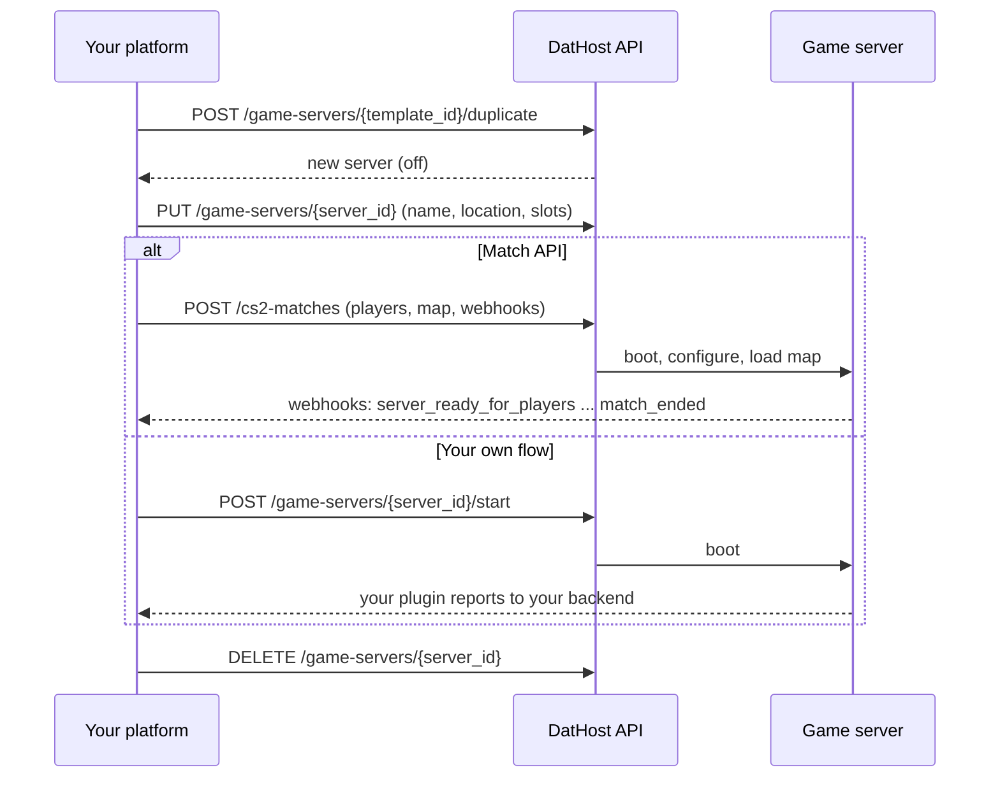

Fetch the complete documentation index at: https://dathost.readme.io/llms.txt. Use this file to discover all available pages before exploring further. Append .md to any documentation page URL to get its markdown version.

# CS2 Platform onboarding

This guide is for anyone building a product on top of DatHost CS2 servers: matchmaking and PUG platforms, leagues and tournaments, training and practice platforms, coaching tools, community hubs. If your product spins up CS2 servers on demand, this is the architecture to start from.

<Callout icon="📘" theme="info">
  ### **Building with an AI assistant?**

  Give it our documentation index at [https://dathost.readme.io/llms.txt](https://dathost.readme.io/llms.txt). Every docs page is also available as plain markdown by appending `.md` to its URL.
</Callout>

All of these products share the same server lifecycle: keep one template server, duplicate it for each match or session, run the game, and delete the copy afterwards. What differs is how the game itself is run, and there you have two options that are both fully supported:

* **The Match API**: the fast path for match-based platforms. DatHost boots the server, whitelists players, enforces teams, parses stats, and pushes every event to your backend as webhooks.
* **Your own flow**: full control for everything else. The server is a normal CS2 server where you install your own plugins, and your plugins talk to your backend directly. Training platforms with custom in-game experiences run this way.

Steps 1 to 3 and teardown are identical for both. Only the "run the game" step differs.

## The big picture

1. **Template server**: one CS2 server you configure once, with your configs, plugins, and settings. It stays off almost all the time.
2. **Duplicate per session**: when a match or session is ready, duplicate the template. The copy is created in the off state.
3. **Configure the copy**: set name, location, slots, and passwords on the duplicate.
4. **Run the game**: either hand the server to the Match API, or start it yourself and let your own plugins take over.
5. **Tear down**: when it is over, delete the duplicate. This part is your responsibility, see [Step 5](#step-5-tear-down-the-server).



Why this pattern works well:

* **You only pay while a server is on.** CS2 servers are billed per slot per hour while running. A stopped duplicate, and your stopped template, cost nothing. Duplicating itself is free.
* **Every session starts from a clean, known state.** No leftover configs or files from the previous one.
* **Template changes roll out automatically.** Update the template once and every future duplicate gets the change.

## Getting started with pay as you go

DatHost supports both subscriptions and pay as you go. For platforms, pay as you go is the recommended model: your servers are short lived, and you pay per slot per hour only while a server is on, from credits you load onto your account. Billing is per minute in practice, each minute costing 1/60 of the hourly rate, so a 40-minute match costs 40 minutes, not a rounded-up hour. A subscription is the better fit if you instead want a pre-set fleet of servers standing by; both work with everything in this guide.

1. <Anchor target="_blank" href="https://dathost.com/sign-up">Create an account</Anchor>. Sign up with email and password rather than a social login; the API authenticates with those same credentials.
2. Add credits on the <Anchor target="_blank" href="https://dathost.com/control-panel/add-credits">add credits page</Anchor>. If you do not see that option in your control panel, reach out to <support@dathost.com>.
3. Start building. Remember that a server that is on keeps charging until it is stopped or deleted, so wire up teardown ([Step 5](#step-5-tear-down-the-server)) early.

## Authentication

All API requests use HTTP Basic auth with your DatHost account email and password:

```bash
curl -u "you@yourplatform.com:your-password" \
  https://dathost.com/api/0.1/game-servers
```

## Step 1: Build your template server

Create a CS2 server in the [control panel](https://dathost.net/control-panel) (or via [POST /game-servers](https://dathost.net/reference/post_game_servers)) and set it up exactly how every server should look: server configs, tickrate settings, custom files.

This is also where your own plugins go. Enable `cs2_settings.enable_metamod` and upload your Metamod or CounterStrikeSharp plugins with the [file API](https://dathost.net/reference/post_game_server_files_item) or FTP, just like on any CS2 server. Every duplicate inherits them.

Test the template by starting it and joining, then stop it. Keep it stopped when you are not editing it, and consider setting `deletion_protection` on it so no automated cleanup can ever delete your template by mistake.

<Callout icon="📘" theme="info">
  ### **File changes and the duplication cache**

  Duplicates are created from a cached copy of the template's files. The cache refreshes roughly once per hour while the template is on, and once more when it stops. If you have just changed files on a running template, call [sync-files](https://dathost.net/reference/post_game_server_sync_files) once before duplicating so the copies include the latest changes.
</Callout>

## Step 2: Duplicate it for each session

When a match or session is ready to launch:

```bash
curl -u "you@yourplatform.com:your-password" -X POST \
  "https://dathost.com/api/0.1/game-servers/{template_id}/duplicate"
```

The response is the new server object. Save its `id`. A few things to know about the copy:

* It is created **off**. Nothing is billed until it boots.
* Settings and files are copied, but **new FTP and MySQL passwords are generated**, and the Steam game server login token (GSLT) is **not** copied. If your setup uses GSLTs, set one on each duplicate.
* You can pass `location` directly in the duplicate request to place the server in the right region in one step (see Step 3).

## Step 3: Configure the server

Set the per-session settings with [PUT /game-servers/\{server\_id}](https://dathost.net/reference/put_game_server_item). The endpoint takes form data:

```bash
curl -u "you@yourplatform.com:your-password" -X PUT \
  "https://dathost.com/api/0.1/game-servers/{server_id}" \
  -F "name=session-42817" \
  -F "location=stockholm" \
  -F "cs2_settings.slots=11" \
  -F "cs2_settings.rcon=$(openssl rand -hex 12)" \
  -F "user_data=your-internal-session-id" \
  -F "autostop=true" \
  -F "autostop_minutes=60"
```

* `location`: where the server runs. Fetch valid IDs from `GET /api/0.1/locations?game=cs2`, or see the [locations mapping](https://dathost.net/reference/server-locations-mapping). Location IDs are historical, not literal: for example `dusseldorf` is physically in Frankfurt, so map IDs to cities using that page rather than the ID text. Many platforms let players vote on the region and pass the winner here. To choose by measured latency instead, or to show players their ping while they pick, have each player's client ping our locations directly over WebSocket; see [measuring latency to DatHost locations](https://dathost.com/docs/ping-server-locations-via-websocket).
* `cs2_settings.slots`: you are billed per slot per hour while the server runs, so set only what you need. For a 5v5 with GOTV, 11 slots is the common choice.
* `cs2_settings.rcon`: generate a fresh RCON password per session so you can send admin commands during the game.
* `user_data`: free-form metadata DatHost never touches. Store your internal match or session ID here so every server maps back to something in your system.
* `autostop`: a safety net, not your primary teardown. When enabled, a server that has been empty for `autostop_minutes` consecutive minutes is stopped automatically. The counter resets whenever someone is on the server.
* `cs2_settings.password`: the server join password. If you run your own flow, set it here. With the Match API you pass it in the match request instead.

<Callout icon="🚧" theme="warn">
  ### **Updating a running server restarts it**

  `PUT` on a server that is on will restart it to apply the changes, and changing `location` assigns a **new IP and port**. Always configure the server while it is off, before the session, and re-read the server object if you ever move it.
</Callout>

<br />

## Step 4: Run the game

<Tabs>
  <Tab title="DatHost Match API">
    The Match API is the fastest way to run competitive matches. One call boots the server, loads the map, whitelists the players, enforces teams, and starts the match flow. During the match DatHost parses rounds and player stats for you and pushes everything to your backend as webhooks. GOTV, tactical and technical pauses, and votekick behavior are all handled and configurable.

    If your product is match-based and the [feature set](https://dathost.net/docs/cs2-match-api-roadmap) covers your needs, start here. If you need in-game behavior the Match API does not provide, run [your own flow](#step-4-option-b-run-it-yourself) instead; both are first-class ways to use DatHost.

    <Callout icon="📘" theme="info">
      ### **Prefer code over prose?**

      The Recipe below walks this entire flow, duplicate to teardown, as one annotated Node.js script you can step through line by line.

      <Recipe slug="run-a-cs2-match-end-to-end" title="Run a CS2 match with the Match API" />
    </Callout>

    ```bash
    curl -u "you@yourplatform.com:your-password" -X POST \
      "https://dathost.com/api/0.1/cs2-matches" \
      -H "Content-Type: application/json" \
      -d '{
        "game_server_id": "{server_id}",
        "players": [
          { "steam_id_64": "76561198234907126", "team": "team1", "nickname_override": "s1mple" },
          { "steam_id_64": "76561239480715690", "team": "team2", "nickname_override": "device" }
        ],
        "team1": { "name": "Team Alpha" },
        "team2": { "name": "Team Bravo" },
        "settings": {
          "map": "de_mirage",
          "connect_time": 300,
          "match_begin_countdown": 15,
          "enable_plugin": true
        },
        "webhooks": {
          "event_url": "https://api.yourplatform.com/webhooks/dathost",
          "enabled_events": ["*"],
          "authorization_header": "your-shared-secret"
        }
      }'
    ```

    Key behaviors:

    - **Do not start the server yourself.** Match creation boots it for you. If the server is already on, it gets restarted first.
    - Only `game_server_id` and `players` are required. Unknown fields are rejected with a 400, so send exactly what the [reference](https://dathost.net/reference/post_api-0-1-cs2-matches) defines.
    - **Maps**: use an official map name (`de_mirage`) or `workshop/{workshop_id}` for workshop maps. Official maps other than de_dust2 briefly load de_dust2 first and then switch; this is a workaround for a CS2 asset loading issue, not a bug in your integration.
    - **Players**: anyone not in the `players` list is kicked on connect, players joining the wrong team are moved or kicked, and `team` can be `team1`, `team2`, or `spectator`. You can list more players than the team size; `team_size` caps how many can actually play, which lets you whitelist substitutes up front. For mid-match emergencies there is also [add player](https://dathost.net/reference/post_api-0-1-cs2-matches-match-id-players).
    - `enable_plugin` installs DatHost's match plugin (CounterStrikeSharp based), which powers pauses and the in-game match experience. It permanently enables Metamod on that server, which is fine for disposable duplicates.
    - `connect_time` (default 300s): if not everyone connects in time, the match is canceled with `cancel_reason: MISSING_PLAYERS:<steam_ids>` listing who was absent, which is exactly what you need for leaver penalties.
    - **One active match per server.** Creating a match on a server that already has one cancels the old match with `NEW_MATCH_STARTED_ON_SERVER`.

    ### Follow the match

    Point `event_url` at your backend and drive your match state machine from the events. The full flow and payloads are on the [Webhooks](https://dathost.net/docs/cs2-match-api-webhooks) page; the ones platforms typically act on:

    | Event                      | What to do                                                                                                                                                                                    |
    | :------------------------- | :-------------------------------------------------------------------------------------------------------------------------------------------------------------------------------------------- |
    | `server_ready_for_players` | Show the connect button. Get `ip`/`raw_ip` and `ports.game` from [GET /game-servers/\{server_id\}](https://dathost.net/reference/get_game_server_item) and give players `connect <ip>:<port>` |
    | `match_started`            | Mark the match live                                                                                                                                                                           |
    | `round_end`                | Update live scores (payload includes both team scores)                                                                                                                                        |
    | `match_ended`              | Record the result, start teardown                                                                                                                                                             |
    | `match_canceled`           | Check `cancel_reason`, requeue or penalize, tear down                                                                                                                                         |

    Set `authorization_header` and verify it on every incoming webhook, since the endpoint is otherwise open to anyone who guesses the URL.

    You can also poll [GET /cs2-matches/\{match_id\}](https://dathost.net/reference/get_api-0-1-cs2-matches-match-id) at any time for full match state, including per-player stats, and use the [console endpoint](https://dathost.net/reference/post_game_server_console) to send server commands mid-match.
  </Tab>

  <Tab title="Your own flow">
    If your product is not a standard competitive match, or you want in-game behavior the Match API does not cover, run the server directly. A duplicate is a complete CS2 server: your Metamod and CounterStrikeSharp plugins from the template, file and FTP access, RCON, console access. Platforms run custom training sessions, practice modes, and entirely custom game experiences this way.

    The flow:

    1. **Boot it**: [POST /game-servers/\{server_id\}/start](https://dathost.net/reference/post_game_server_start). Note it reboots the server if it is already on.
    2. **Wait until it is up**: poll [GET /game-servers/\{server_id\}](https://dathost.net/reference/get_game_server_item) until `booting` is `false`. Use the single-server GET for this; the list endpoint does not refresh the booting state.
    3. **Hand out the address**: `ip` (or `raw_ip`) plus `ports.game`, with the `cs2_settings.password` you set in Step 3.
    4. **Run your session**: this is your territory. Your plugins own the in-game logic and report to your backend directly, exactly like DatHost's own match plugin reports to the Match API. For ad hoc control you also have [send console command](https://dathost.net/reference/post_game_server_console) and [read console backlog](https://dathost.net/reference/get_game_server_console).
    5. **Decide when it is over**: your plugin or your timer. Then tear down like everyone else.

    <Callout icon="🚧" theme="warn">
      ### `players_online`**&#x20;is not live data**

      The `players_online` field on the server object can lag behind reality by 5 to 10 minutes. It is fine for dashboards, but do not build session logic on it. Use your own plugin or the console as the source of truth for who is on the server.
    </Callout>

    The trade-off versus the Match API: you own player access control (server password, or a whitelist in your own plugin), stats and reporting, and end-of-session detection. Everything else in this guide applies unchanged.
  </Tab>
</Tabs>

## Step 5: Tear down the server

<Callout icon="❗️" theme="error">
  ### **DatHost never stops or deletes your servers**

  When a Match API match ends or is canceled, players are kicked but the server keeps running, and a running server keeps billing. The same is true when your own session ends. Teardown is always your job.
</Callout>

When it is over (`match_ended`, `gotv_stopped`, or `match_canceled` webhooks on the Match API path; your own end-of-session signal on the custom path):

1. If you want the GOTV demo or any other files, [download them](https://dathost.net/reference/get_game_server_files_item) first. Deleting the server deletes its files.
2. Consider saving the [console backlog](https://dathost.net/reference/get_game_server_console) as well. Established platforms archive it with each session; it is what you will want when investigating a crash, a plugin issue, or a player dispute after the server is gone.
3. [DELETE the server](https://dathost.net/reference/delete_game_server_item).

Also delete the duplicate in your error handling: if anything fails between duplication and the session starting, an orphaned server that later gets started is pure cost. Enable `autostop` on the template so even servers your teardown misses stop themselves once empty.

## Launch checklist

* [ ] Template server configured and tested, kept stopped, with `deletion_protection` on
* [ ] Duplicate and configure flow implemented, `user_data` linking servers to your sessions
* [ ] Match API path: webhook endpoint live and verifying `authorization_header`, `MISSING_PLAYERS` wired into requeue/penalty logic
* [ ] Custom path: boot, poll `booting`, session-end detection implemented
* [ ] Teardown on every exit: normal end, cancellation, and setup failures
* [ ] `autostop` enabled as a safety net